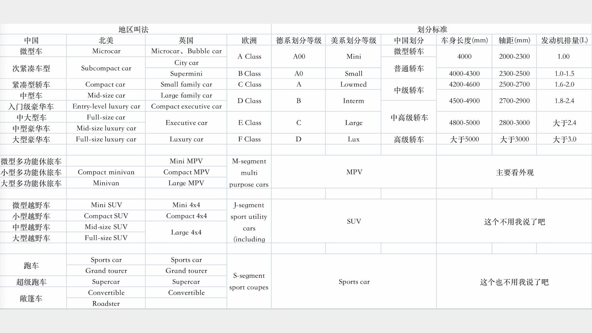

-----

| Title     | 车的分类                                             |
| --------- | ------------------------------------------------ |
| Created @ | `2024-06-23T09:37:09Z`                           |
| Updated @ | `2024-07-20T10:59:09Z`                           |
| Labels    | \`\`                                             |
| Edit @    | [here](https://github.com/junxnone/che/issues/2) |

-----

# 车的分类

  - 较为主流的分类方法包括根据动力分，根据空间分

## 根据动力源分类

  - 油车
  - 电车
  - 混动
      - **插电混动**: 发动机可以参与动力输出
      - **油电混动**:
      - **增程式**: 没电了，发动机负责充电

## 根据车型分类

